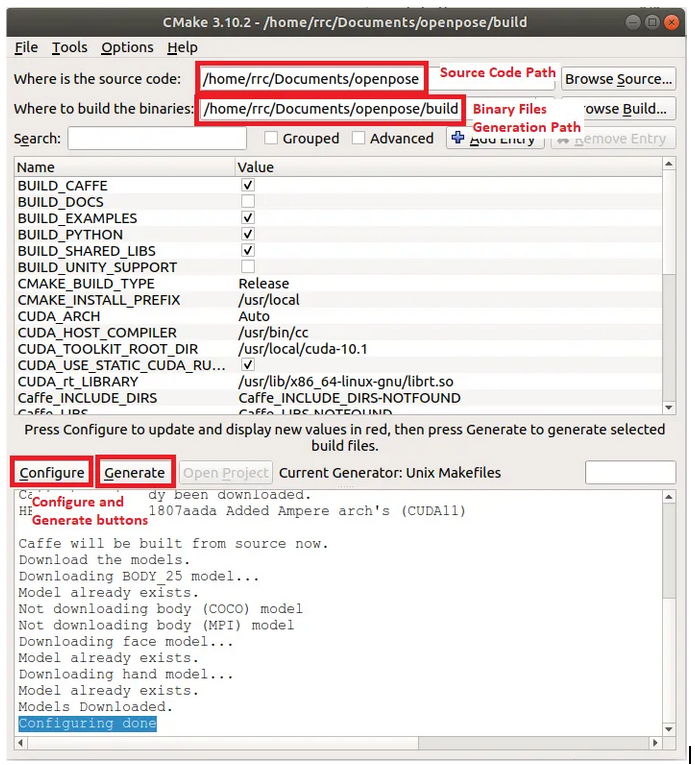
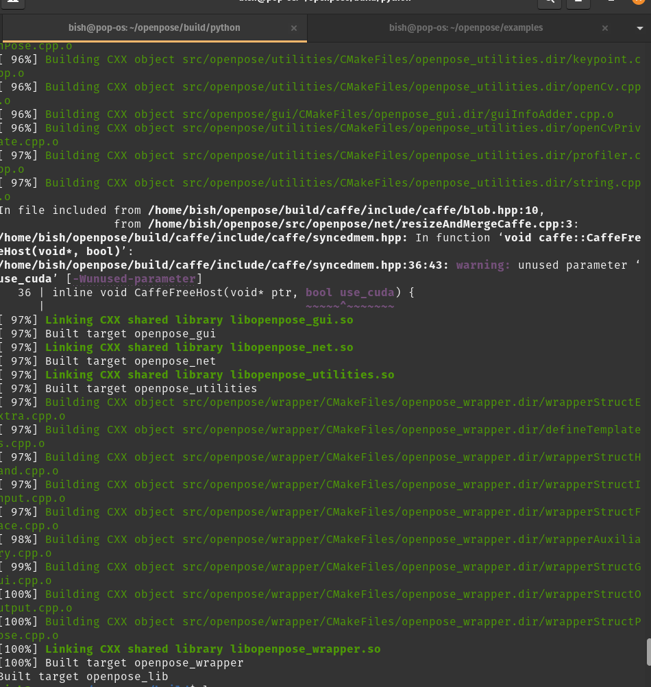
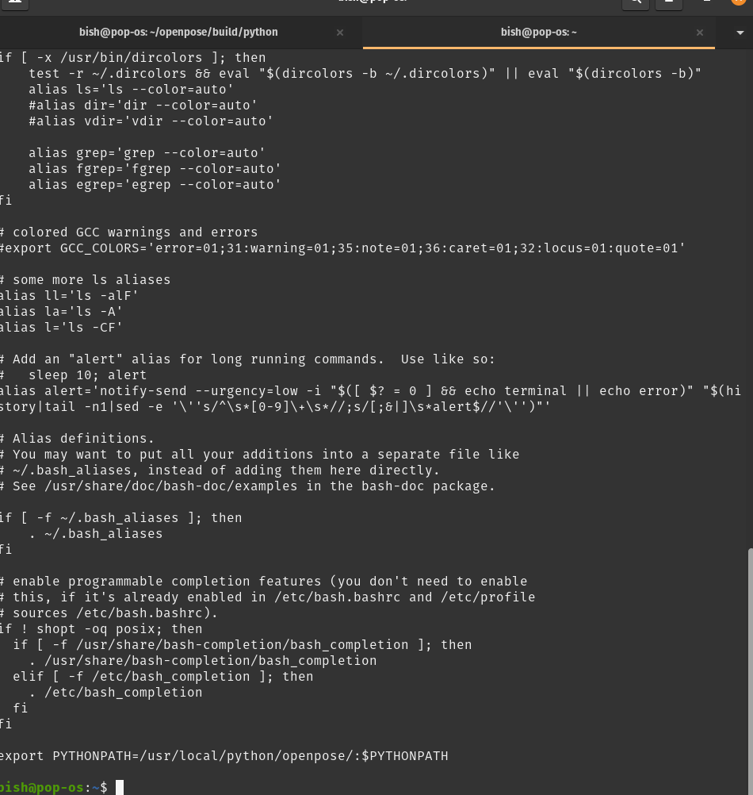
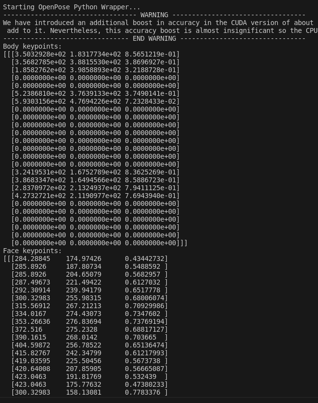

## Openpose-Installation and Implementation in Linux

1. Deactivate anaconda
2. Install the cmake-gui using following commands.
   ``` 
    sudo apt purge cmake-qt-gui
    sudo apt install libssl-dev
    sudo apt-get install qtbase5-dev
   
   ```
   
3. Download the latest version of cmake-gui from official webpage.
   Unzip the file and use the following command.
   ```
    cd cmake-3.xx.x 
    ./configure — qt-gui
    ./bootstrap && make -j`nproc` && sudo make install -j`nproc`
   ```
   
4. Install OpenCV

   ```
    sudo apt-get install python3-dev
    sudo pip3 install numpy opencv-python
   ```
   
5. Clone the openpose latest repository from the official site.
    
    ```
    git clone https://github.com/CMU-Perceptual-Computing-Lab/openpose
    cd openpose/ 
    git submodule update —init —recursive —remote
    ```
    
6. Install the caffe prerequisites using the following command.
    
    ```
    sudo bash ./scripts/ubuntu/install_deps.sh
    ```
    
    Optional: To ensure no more compilation errors appear later on, install the following packages
    ```
    sudo apt-get install protobuf-compiler libprotobuf-dev libgoogle-glog-dev libblkid-dev e2fslibs-dev libboost-all-dev libaudit-dev libcanberra-gtk-module libcanberra-gtk3-module
     ```

7. CMake configuration
    
    ```
    cd {root_folder}
    mkdir build/
    cd build/
    cmake-gui ..
    ```
    

8. You can turnoff the download model flag and download manually instead.
    
    Turn off the USE_CUDA flag
    Cmake option to : UNIX Files
    NOTE: To set GPU_MODE flag to CPU_ONLY when building the tool via cli, 
    append -D GPU_MODE:STRINGS=CPU_ONLY to the cmake command.
    Also turn ON the BUILD PYTHON flag

9. Enter configure and generate.
    If any error about installation occurs, it suggests the package to install.
    Install it using the recommended commands.
    Close the CMake-GUI window and return to your terminal. To compile into binary files, run the command below:
    
    ```
    cd build/
    make -j`nproc`
    ```
    
    
    
    Note: 
    The models should be kept in the same way as the downloaded models are kept inside the models/ folder.
    Better not to download the model manually.
    After the download completes,Copy the models/ directory in your project directory.

10. To install the Openpose python module called pyopenpose, do the following command:
    
    ```
    cd {root_folder}/build/pythonsudo 
    make install
    ```
    
    This will install the pyopenpose python module in the /usr/local/python/openpose folder. In your .bashrc file, include the path in the PYTHONPATH environment variable:
    Go to home and follow following commands:
    
    ```
    $ ls -a
    $ cat .bashrc
    $ vi .bashrc
    ```
    
    Put the following script into the file.
    
    ```
    export PYTHONPATH=/usr/local/python/openpose/:$PYTHONPATH
    :wq
    ```
    
    

11. Test the import:
    
    ```
    source ~/.bashrc
    python3
    # Inside python3
    >>> import pyopenpose
    ```
    
12. If nothing happens after you import the module, this means that you have again successfully complete the python module global installation. Well Done !!

    

